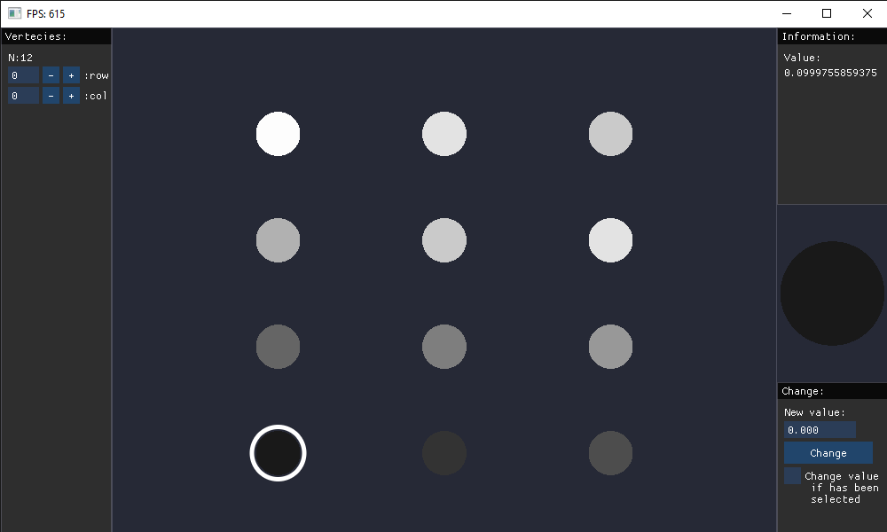

## Visualization of Cuda tensors with OpenGL

Visualization of a PyTorch tensor on Cuda device using OpenGL, without the need to transfer data to the CPU. The visualization is real-time, meaning that any changes to the tensor within the render loop will be immediately represented.

## Example
    numpyArray = np.array([[0.1, 0.2, 0.3],
                           [0.4, 0.5, 0.6],
                           [0.7, 0.8, 0.9],
                           [1.0, 0.9, 0.8],])
                        
    tensor = torch.tensor(numpyArray,
                        dtype=torch.float32,
                        device=torch.device('cuda:0'))

    GUI(tensor).initializeOpenGL()

    

## Feature
- **Efficient GPU Rendering:** Avoids data transfer to the CPU, maximizing performance. 
- **Handling Large Tensors:** Capable of handling tensors with dimensions up to 1000x1000.
- **Real-time Performance:** Provides high-performance rendering for responsive visualization (FPS>100 on 1050-ti).
- **Interactive interface**
- **Value Manipulation in GUI:** Allows changing tensor values directly within the GUI.
- **Keyboard and Mouse Functionality:** Supports 'W', 'A', 'S', 'D' keys and mouse functionality for selection.

## Reqirment
- **CUDA 11.8**
- **PyTorch 2.0.1**

- **GLFW**
- **IMGUI**
- **PyOpenGL**
- **numpy**

### Install PyTorch with CUDA 11.8
    pip3 install torch torchvision torchaudio --index-url https://download.pytorch.org/whl/cu118

## Usage

### Float values
    python Float(Advance)/Visualize_Float_Tensor_GL_IMGUI.py

### Boolean values and more basic functionality
    python Boolean(Basic)/Visualize_Boolean_Tensor_GL_IMGUI.py
