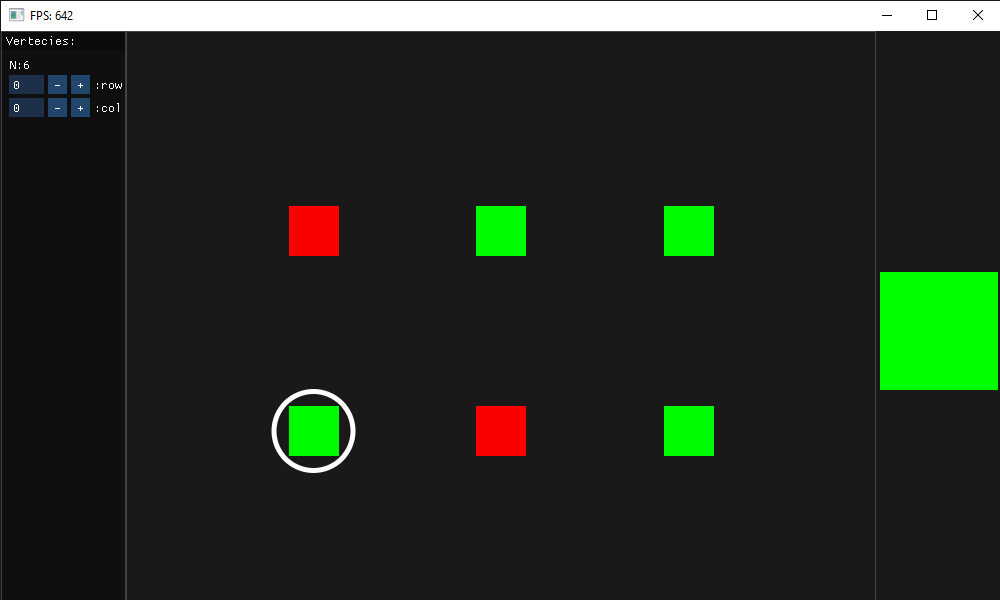

## Visualization of Cuda tensors with OpenGL

Visualization of a PyTorch 2D tensor on Cuda device using OpenGL, without the need to transfer data to the CPU. The visualization is real-time, meaning that any changes to the tensor within the render loop will be immediately represented.

## Usage and example

### Float Values
    import torch

    def update_tensor(tensor):
        import time 
        from math import sin
        tensor += sin(time.time())/1000
        return tensor
        
    tensor = torch.tensor([[0.1, 0.2, 0.3 ],
                        [0.4, 0.5, 0.6],
                        [0.7, 0.8, 0.9],
                        [1.0, 0.9, 0.8],],
                        dtype=torch.float16,
                        device=torch.device('cuda:0'))

    from Float_Advance.Visualize_Float_Tensor_GL_IMGUI import GUI
    GUI(tensor, update_tensor).renderOpenGL()

    

### Boolean Values
    numpyArray = np.array([[True, False, True ],
                        [False, True, True],])
    tensor = torch.tensor(numpyArray,
                        dtype=torch.bool,
                        device=torch.device('cuda:0'))
    show_2d_tensor(tensor)

    

## Features
- **Efficient GPU Rendering:** Avoids data transfer to the CPU, maximizing performance. 
- **Handling Large Tensors:** Capable of handling tensors with dimensions up to 1000x1000.
- **Real-time Performance:** Provides high-performance rendering for responsive visualization (FPS>100 on 1050-ti).
- **Interactive interface**
- **Value Manipulation in GUI:** Allows changing tensor values directly within the GUI.
- **Keyboard and Mouse Functionality:** Supports 'W', 'A', 'S', 'D' keys and mouse functionality for selection.

## Dependencies
- **CUDA 11.8**
- **PyTorch 2.0.1**
- **CUDA-PYTHON**
- **GLFW**
- **PyOpenGL**
- **PYIMGUI**
- **numpy**

### Install PyTorch with CUDA 11.8
    pip3 install torch torchvision torchaudio --index-url https://download.pytorch.org/whl/cu118
